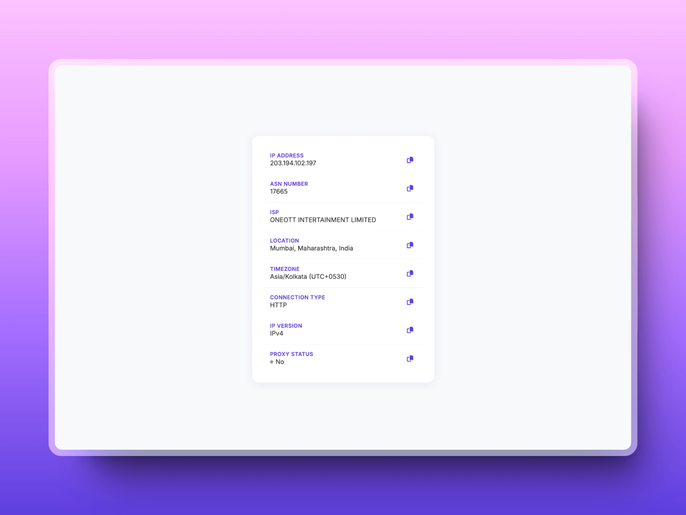

# IP Info

A modern, lightweight tool to check your IP address and network details with both web and terminal interfaces.

## Features

- 🚀 Clean, modern UI with animations
- 📋 One-click copy for all information
- 🔄 Real-time network information
- 💻 Terminal-friendly interface
- 🌐 Detailed network insights:
  - IP Address
  - ASN Number
  - ISP Details
  - Geographic Location
  - Timezone
  - Connection Type
  - IP Version
  - Proxy Detection

## Usage

### Web Interface
Simply visit [https://ip.arson.me](https://ip.arson.me)

### Terminal
